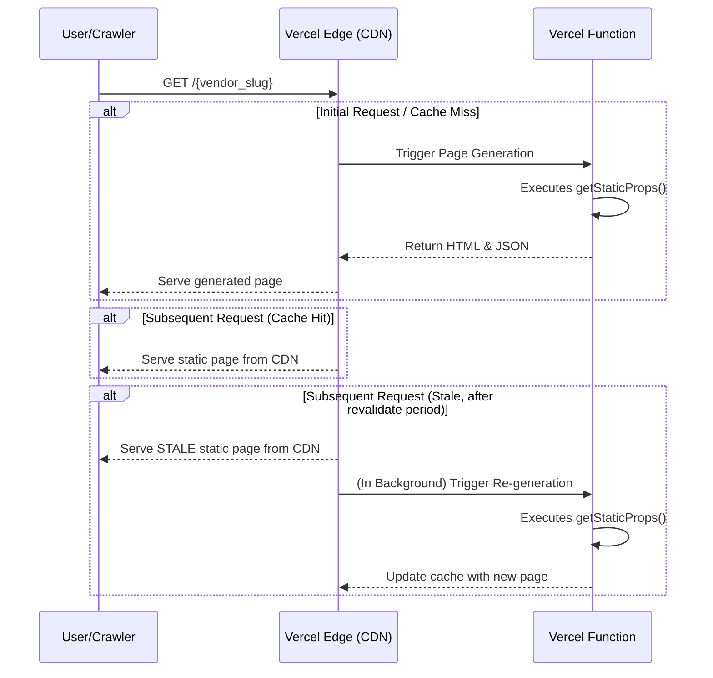

# Section 13 of 18: Public-Facing Architecture (SEO)

This section details the architecture for the public-facing vendor brand pages (e.g., `/the-burger-den`), which are critical for search engine discoverability while adhering to our "Free Tier Maximization" principle.

## Rendering Strategy: Static Site Generation (SSG) with Incremental Static Regeneration (ISR)

To ensure vendor pages are fast, SEO-friendly, and cost-effective, we will use **SSG with ISR**.

*   **Rationale:** Pure Server-Side Rendering (SSR) executes on every request, risking high costs that could exceed Vercel's free tier limits. ISR provides the perfect balance: pages are pre-built as static HTML for maximum performance and SEO, and then automatically re-generated in the background at a defined interval (e.g., every 5 minutes). This dramatically reduces function invocations, keeping us within the free tier, while ensuring data remains reasonably fresh.

## ISR Data Flow

The following diagram illustrates the data flow for a public vendor page request.



## Implementation Details

*   **Data Fetching:** Data for a vendor page will be fetched directly within the `page.tsx` Server Component. We will use `fetch` requests to our own API routes (which in turn fetch from Supabase/GSheets) or directly use the Supabase client on the server.
*   **Revalidation:** To achieve ISR, the primary data fetch will use the `next: { revalidate: 300 }` option. This instructs Next.js to cache the page for 300 seconds (5 minutes), after which a new request will trigger a background regeneration.
    ```typescript
    // Example within a data-fetching service
    fetch('https://.../data', { next: { revalidate: 300 } });
    ```
*   **Static Generation:** To pre-build pages for known vendors at build time, we will export a `generateStaticParams` function from `src/app/[vendor_slug]/page.tsx`. This function will return a list of all `vendor_slug`s to be generated.

## On-Page SEO Strategy

To ensure our vendor pages rank well for specific search queries (e.g., "Eggsperiment" or "dishes of Eggsperiment"), we will implement a dynamic metadata strategy.

*   **`generateMetadata` Function:** In `src/app/[vendor_slug]/page.tsx`, we will export an async function called `generateMetadata`. This server-side function will fetch the specific vendor's brand and dish data.
*   **Dynamic Title:** The function will generate a unique, descriptive `<title>` tag for each vendor. 
    *   *Example:* `<title>Eggsperiment Menu | Delicious Dishes & Offers | YumYum</title>`
*   **Dynamic Meta Description:** The function will generate a compelling `<meta name="description">` tag that includes the vendor's name and some of their popular dishes, encouraging clicks from search results.
    *   *Example:* `<meta name="description" content="Explore the official menu of Eggsperiment on YumYum, featuring our famous Spicy Paneer Pizza and Cheesy Garlic Bread. Order online now!">`

This approach ensures that every vendor page sends strong, specific signals to search engines, directly addressing the goal of making vendors highly discoverable on the internet.

---
