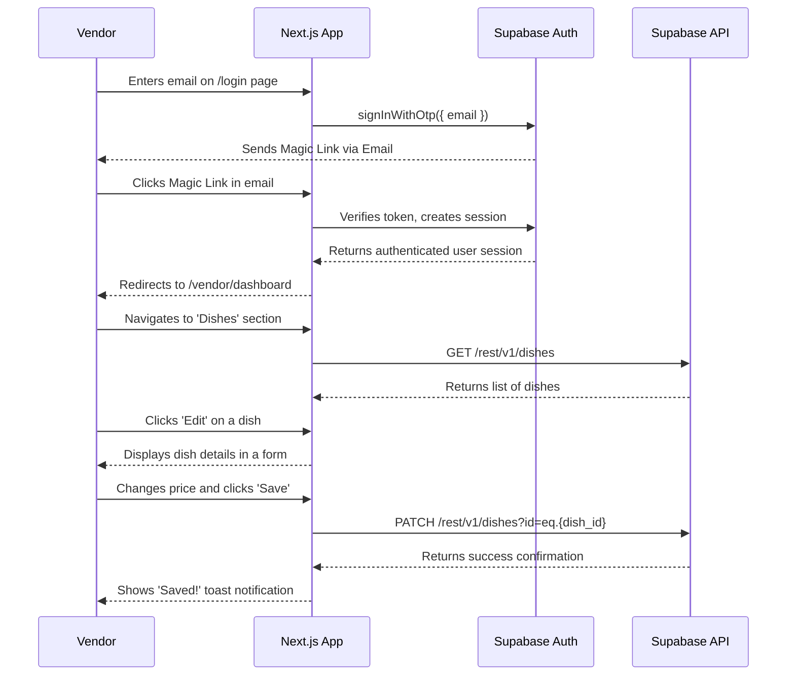

# Section 8 of 18: Core Workflows

This diagram illustrates the sequence of events for a vendor logging in and updating a dish in the new Premium Tier dashboard.

```mermaid
sequenceDiagram
    participant User as Vendor
    participant Frontend as Next.js App
    participant SupabaseAuth as Supabase Auth
    participant SupabaseAPI as Supabase API

    User->>Frontend: Enters email on /login page
    Frontend->>SupabaseAuth: signInWithOtp({ email })
    SupabaseAuth-->>User: Sends Magic Link via Email

    User->>Frontend: Clicks Magic Link in email
    Frontend->>SupabaseAuth: Verifies token, creates session
    SupabaseAuth-->>Frontend: Returns authenticated user session
    Frontend-->>User: Redirects to /vendor/dashboard

    User->>Frontend: Navigates to 'Dishes' section
    Frontend->>SupabaseAPI: GET /rest/v1/dishes
    SupabaseAPI-->>Frontend: Returns list of dishes

    User->>Frontend: Clicks 'Edit' on a dish
    Frontend-->>User: Displays dish details in a form

    User->>Frontend: Changes price and clicks 'Save'
    Frontend->>SupabaseAPI: PATCH /rest/v1/dishes?id=eq.{dish_id}
    SupabaseAPI-->>Frontend: Returns success confirmation
    Frontend-->>User: Shows 'Saved!' toast notification
```

---
