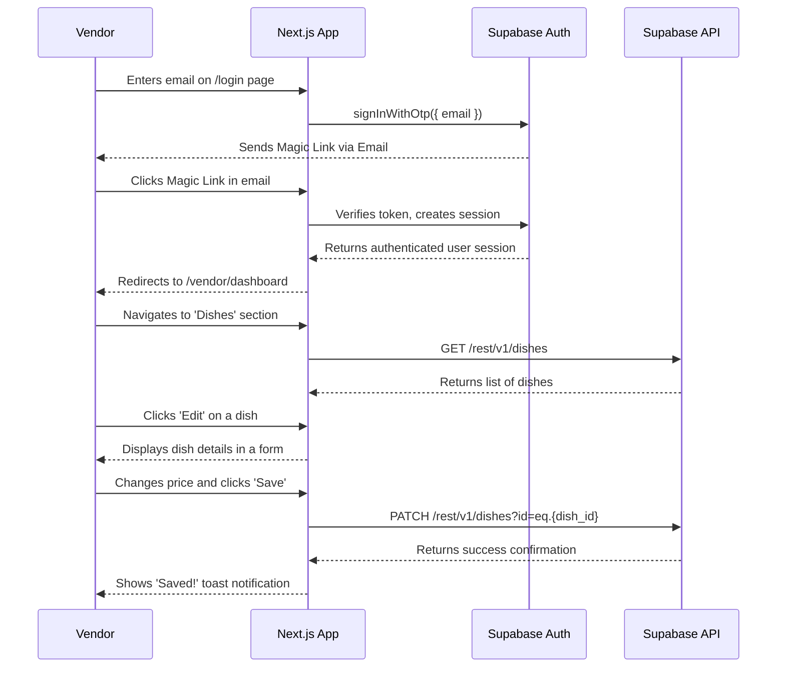

# Section 8 of 18: Core Workflows

This diagram illustrates the sequence of events for a vendor logging in and updating a dish in the new Premium Tier dashboard.

---

## 8.1 Authentication Workflow

Our authentication process primarily leverages Supabase's magic link functionality. The updated workflow is as follows:

1.  **User Initiates Login:** A user enters their email address on the login page.
2.  **Email Verification (Vendor Mapping Check):** Before sending a magic link, the system will check if the provided email address exists in the `public.vendor_mappings` table.
    *   **If Email NOT Found:** If the email is not present in the `vendor_mappings` table (meaning the user is not part of the YumYum network), a magic link will *not* be sent. Instead, an appropriate error message will be displayed to the user (e.g., "This email is not registered with YumYum. Please contact support if you believe this is an error."), along with a button to navigate back to the home page.
    *   **If Email Found:** If the email is found in the `vendor_mappings` table, a magic link will be sent to the user's email address via Supabase.
3.  **Magic Link Clicked:** The user clicks the magic link in their email.
4.  **Successful Login & Redirection:** Upon successful authentication via the magic link, the user will be redirected to their specific vendor dashboard at the URL `/{vendor-slug}/dashboard`. The `vendor-slug` will be retrieved from the `vendor_mappings` table based on the authenticated email ID.
5.  **Session Management:** Supabase handles session creation and management.

This ensures that only registered vendors can access the system and are directed to their personalized dashboard immediately after login.
