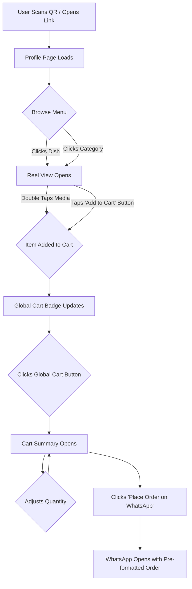

# YumYum UI/UX Specification

## Introduction

This document defines the user experience goals, information architecture, user flows, and visual design specifications for YumYum's user interface. It serves as the foundation for visual design and frontend development, ensuring a cohesive and user-centered experience.

### Overall UX Goals & Principles

- **Target User Personas:**
  - **The Ambitious Street Food Vendor:** Owner-operators focused on growth, comfortable with daily apps but not tech-savvy. They need simplicity and clear ROI.
  - **The Savvy Cloud Kitchen:** Tech-savvier operators aiming to increase profit margins by moving away from high-commission aggregators.
- **Usability Goals:**
  - **Radical Simplicity:** A vendor can set up and manage their entire digital presence from a tool they already know (Google Sheets).
  - **Blazing-Fast Experience:** The customer-facing menu should feel as fast and fluid as a native application.
  - **Frictionless Ordering:** The path from viewing a dish to placing an order via WhatsApp should be intuitive and require minimal steps.
- **Design Principles:**
  1.  **Vendor-First Value:** Every design choice must directly contribute to the vendor's success (increasing sales, saving time, or building their brand).
  2.  **Instagram-Inspired UX:** Leverage the familiar, visually-driven patterns of Instagram (reels, stories, profiles) to create an intuitive and modern customer experience.
  3.  **Delight in the Details:** Use thoughtful micro-interactions and polished animations to make the experience feel premium and engaging.
  4.  **Mobile-First, Always:** The experience must be flawless on a mobile device, for both the vendor and the customer.

## Information Architecture (IA)

The information architecture for YumYum is designed to be flat and intuitive, centered around two primary user experiences: the vendor's profile (the "shopfront") and the full-screen reel view (the "menu").

### Site Map / Screen Inventory

```mermaid
graph TD
    subgraph "Main Application"
        A[Profile Page] --> B{Reel View};
        A(Profile Page) -- QR Code --> A;
        B -- Add to Cart --> C;
        A --> C{Cart Summary};
        C --> D[WhatsApp Order];
        C --> E[UPI Pay];
        C --> F{Feedback Funnel};
        F -- High Rating --> G[Google Review];
        F -- Low Rating --> H[Private WhatsApp Feedback];
    end

    subgraph "Utility Pages"
        U[/[vendor-slug]/upload]
    end
```

### Navigation Structure

- **Primary Navigation:** The core navigation is managed through persistent UI elements rather than a traditional menu.
  - The **Global Cart Button** is always accessible from the top-left of the screen.
  - The **Vendor Profile Page** (Dish Grid) acts as the main "home" screen.
  - The **Reel View** is a modal experience that takes over the full screen, acting as the primary browsing interface.
- **Secondary Navigation:**
  - On the Profile Page, the **Category Highlights Bar** allows users to jump directly into the Reel View filtered by a specific category.
  - The **Controls Bar** (Veg Only, Sort, Search) provides filtering for the main dish grid.
  - Within the Reel View, the **Right-Side Action Bar** provides access to description, filtering, and sharing functionality.

## User Flows

### Core Ordering Flow

- **User Goal:** To browse the menu, select items, and place an order with the vendor.
- **Entry Points:** Scanning the vendor's QR code; clicking a direct link to the vendor's page.
- **Success Criteria:** The user successfully opens WhatsApp with a pre-formatted message containing their complete order, ready to send to the vendor.

#### Flow Diagram



#### Edge Cases & Error Handling:

- An item is marked as `instock: 'no'`: It will be displayed as visually greyed out and disabled, preventing it from being added to the cart.
- The user's cart is empty: The "Place Order on WhatsApp" button in the Cart Summary will be disabled.
- Initial data fetch fails: A user-friendly error message is displayed, and a critical alert is sent to the Lark webhook.

### Key Screen Layouts

#### Main Profile & Menu Screen

- **Purpose:** To serve as the vendor's primary digital storefront. It establishes the brand's identity, provides top-level menu navigation, and allows users to browse all available dishes at a glance.
- **Key Elements:**
  1.  **Brand Header:** (Top of the screen) Contains the vendor's logo, name, cuisine type, bio, and a row of icon-based links (e.g., WhatsApp, payment, location).
  2.  **Category Highlights:** (Below the header) A horizontally-scrolling list of circular category buttons, each with a colored gradient ring, similar to Instagram Stories.
  3.  **Controls Bar:** (Below categories) A simple bar containing the "Veg Only" toggle, a "Sort by Price" control, and a Search input field.
  4.  **Dish Grid:** (Main content area) A responsive 3-column grid of square dish images that fills the rest of the screen.
- **Interaction Notes:** Tapping a category button or a dish card smoothly transitions the user into the full-screen "Reel View". The controls in the `ControlsBar` filter the `DishGrid` instantly on the client-side.

## Component Library / Design System

- **Design System Approach:** We will adopt a lean design system approach, leveraging **Shadcn UI** as the base library for its accessibility and composability. Project-specific components will be built by combining these primitives.
- **Core Components:**
  - `BrandHeader`: Composite component for the vendor's "bio".
  - `CategoryHighlight`: The circular, Instagram-style category button.
  - `ControlsBar`: The container for the Veg-toggle, Sort, and Search controls.
  - `DishCard`: The square image card for the main grid, with a pulsing dot for tagged items.
  - `ReelView`: The full-screen, glassmorphic container for the vertical menu browsing experience.
  - `CartSummary`: The adaptive bottom-sheet drawer for checkout.

## Branding & Style Guide

### Visual Identity

- **Brand Guidelines:** The overall aesthetic is clean, modern, and "food-centric," inspired by the visual language of apps like Instagram.

### Color Palette - Color Usage Guide

| **Color Type**                      | **Hex Code**               | **Usage**                                                                                    |
| ----------------------------------- | -------------------------- | -------------------------------------------------------------------------------------------- |
| **Background / App Canvas**         | `#FEF3E2`                  | Warm cream background for pages and app base. Sets the inviting, food-friendly tone.         |
| **Surface / Card**                  | `#FFFFFF`                  | Clean white for cards, sheets, and containers — improves content contrast.                   |
| **Primary**                         | `#FAB12F`                  | Main brand orange — used for CTAs (e.g. “Order Now”), highlights, icons, active states.      |
| **Primary Strong (Hover / Active)** | `#FA812F`                  | Slightly deeper orange for hover or pressed states of primary buttons.                       |
| **Primary Foreground**              | `#0B0B0B`                  | Text/icon color on primary backgrounds (ensures strong readability).                         |
| **Secondary**                       | `#0B0B0B`                  | Headlines, secondary buttons, key typography — high-contrast dark text.                      |
| **Secondary Foreground**            | `#FEF3E2`                  | Used on dark secondary backgrounds (inverse contrast).                                       |
| **Accent**                          | `#FFC857`                  | Highlight tags like “Bestseller”, small badges, or promo chips — complements primary orange. |
| **Success**                         | `#16A34A`                  | Positive confirmations (e.g. “Order placed!”), success toasts.                               |
| **Warning**                         | `#F59E0B`                  | Non-critical alerts (e.g. “Low stock”).                                                      |
| **Error / Destructive**             | `#DD0303`                  | Error messages, delete actions, destructive confirmation buttons.                            |
| **Text Primary**                    | `#111827`                  | Default readable text color for body content.                                                |
| **Text Secondary**                  | `#6B7280`                  | Secondary labels, helper text, timestamps, muted info.                                       |
| **Muted / Disabled**                | `#9CA3AF`                  | Disabled buttons, placeholders, less prominent UI text.                                      |
| **Border / Divider**                | `#E6E6E6`                  | Dividers, card outlines, and input borders for subtle separation.                            |
| **Focus Ring**                      | `rgba(255, 200, 87, 0.25)` | Soft gold focus ring for accessible focus indication.                                        |

---

### 💡 Quick Design Tips

- **Buttons:** Use `#FAB12F` background with `#0B0B0B` text → hover `#FA812F`.
- **Cards:** Use `#FFFFFF` surface on `#FEF3E2` page background for depth.
- **Headlines:** Use `#0B0B0B` for strong contrast.
- **Error states:** Use `#DD0303` only for destructive or true errors.
- **Highlight tags:** Use `#FFC857` to stand out from primary actions without competing.

---

### Typography

- **Font Families:**
  - **Primary:** `Inter` (or a similar sans-serif system font) for all UI text for its clean readability.
- **Type Scale:**
  | Element | Size | Weight | Line Height |
  | :--- | :--- | :--- | :--- |
  | H1 | 32px | 700 | 1.2 |
  | H2 | 24px | 700 | 1.3 |
  | H3 | 20px | 600 | 1.4 |
  | Body | 16px | 400 | 1.5 |
  | Small | 14px | 400 | 1.5 |

### Iconography

- **Icon Library:** **Lucide Icons** will be used for its clean, modern style and seamless integration with Shadcn UI.

## Accessibility Requirements

- **Compliance Target:** The application **must** meet **WCAG 2.1 Level AA** standards.
- **Key Requirements:**
  - **Visual:** All text must meet a minimum contrast ratio of 4.5:1. All interactive elements must have clear focus indicators.
  - **Interaction:** The entire user flow must be navigable using only a keyboard. All components must be screen-reader friendly with appropriate ARIA labels. Touch targets must be at least 44x44px.
  - **Content:** All images must have descriptive `alt` text. A logical heading structure must be used.

## Responsiveness Strategy

- **Breakpoints:**
  | Breakpoint | Min Width | Target Devices |
  | :--- | :--- | :--- |
  | Mobile | < 768px | Most smartphones |
  | Tablet | 768px | iPads, tablets |
  | Desktop | > 1024px | Laptops, desktops |
- **Adaptation Patterns:**
  - **Layout Changes:** The `DishGrid` will change from a 2-column layout on mobile to a 3-column layout on tablet and desktop.
  - **Navigation Changes:** The `BrandHeader`'s icon links may wrap to a second line on smaller mobile screens.

## Animation & Micro-interactions

- **Motion Principles:** Motion should be purposeful, fluid, and fast, enhancing the user's sense of control and providing clear feedback. We will follow Material Design's principles for motion.
- **Key Animations:**
  - **Add to Cart:** A subtle "cooking-pot" icon animation appears over the dish when added via double-tap.
  - **Page/View Transitions:** Smooth, fading transitions between the Profile page and the Reel View.
  - **Drawer Animation:** The Cart Summary and other bottom sheets will slide in and out smoothly.
  - **Button Feedback:** All buttons will have a subtle press/tap animation.

## Next Steps

- **Immediate Actions:**
  1.  Final stakeholder review of this specification.
  2.  Handoff to the development team to begin implementing Epic 1.
  3.  Begin creating high-fidelity mockups and prototypes in Figma based on this spec.
- **Design Handoff Checklist:**
  - [x] All user flows documented
  - [x] Component inventory complete
  - [x] Accessibility requirements defined
  - [x] Responsive strategy clear
  - [x] Brand guidelines incorporated
  - [x] Performance goals established
